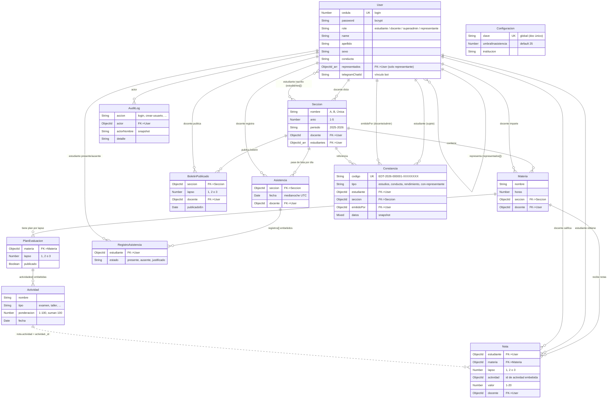
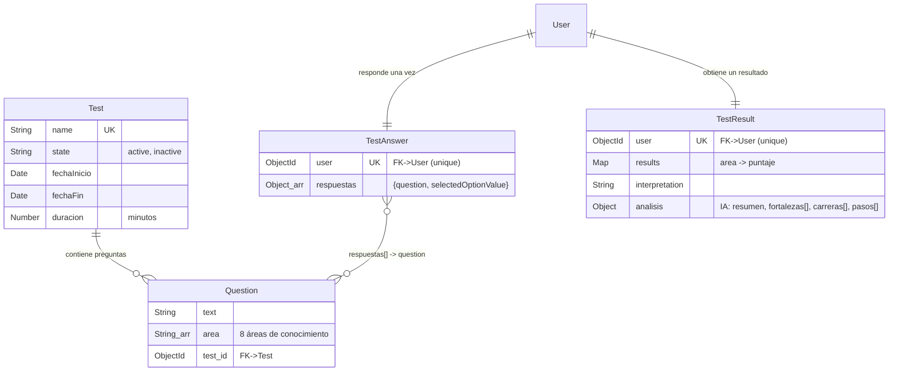
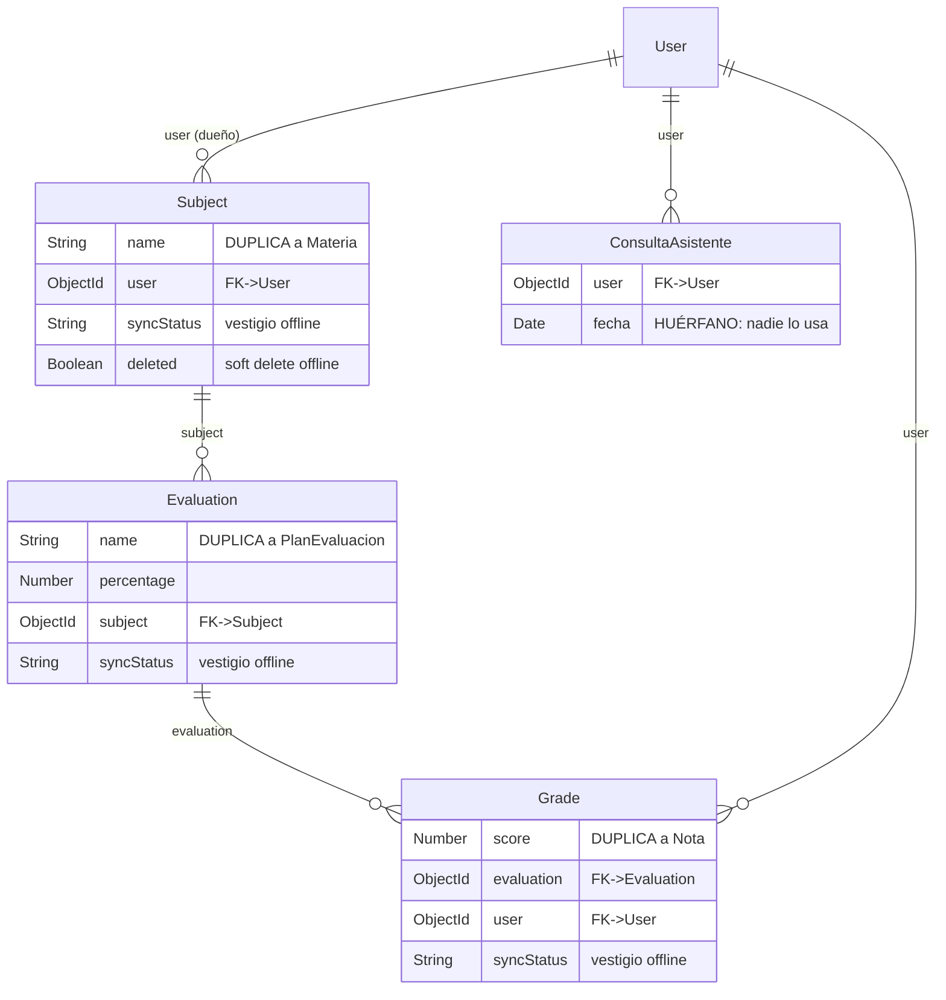

# EduTrack Insight — Arquitectura técnica y modelo de datos

> Documento técnico para el equipo de desarrollo. Describe cómo funciona el sistema
> **realmente hoy**, el modelo entidad-relación de la base de datos, y qué modelos están
> **activos** frente a los que son **legado / huérfanos** (vestigios de un diseño anterior).
>
> Generado leyendo el código fuente (`Backend-Diagnostico-vocacional/src/`), no la
> documentación de marketing.

---

## 1. Resumen del sistema

**EduTrack Insight** es un sistema de **gestión académica** (Educación Media General
venezolana, currículo MPPE) con un módulo de **diagnóstico vocacional por IA**. Cubre 4 roles
(estudiante, docente, representante, super admin) con paneles separados y protegidos.

### Arquitectura real: cliente-servidor clásico, 100% online

```
┌────────────────────┐     HTTPS / REST      ┌────────────────────┐     ┌──────────────┐
│  Frontend React 19 │ ───────────────────>  │  API Express 5     │ ──> │ MongoDB Atlas│
│  (SPA, CRA)        │  <───── JSON ───────  │  (Mongoose 8)      │     │  (nube)      │
│  Vercel            │                        │  Render            │     └──────────────┘
└────────────────────┘                        │        │                        
        │                                      │        ├──> OpenRouter (IA, nube)
        │ PDFs con jsPDF                        │        └──> Telegram Bot API (avisos)
        │ (en el navegador)                     │
        └───────────────────────────────────────┘
```

- **Autenticación:** JWT (`jsonwebtoken`) + `bcryptjs`. **Login por cédula** (no por email).
  Middleware `auth([roles])` protege cada ruta por rol.
- **Frontend:** React 19 (Create React App, SPA de cliente). Los PDFs (boletines,
  constancias, reportes) se generan **en el navegador** con `jsPDF` + `jspdf-autotable`.
- **Backend:** Express 5 + Mongoose 8. Endurecido con `helmet`, `express-rate-limit` (login)
  y sanitización de queries (`sanitizeFilter` de Mongoose).
- **Despliegue:** Frontend en **Vercel**, Backend en **Render**, DB en **MongoDB Atlas**.

### ⚠️ Aclaración importante: "offline-first + IA local" NO es real

Parte de la documentación antigua (README viejo, comentarios) describe una arquitectura
**offline-first con Dexie.js/IndexedDB** e **IA local con Ollama/Gemma**. **Eso nunca se
implementó** o fue reemplazado. La realidad del código:

| Lo que dice la narrativa vieja | Lo que hace el código hoy |
|---|---|
| Offline-first con IndexedDB / Dexie.js | ❌ No existe. La app es 100% online (fetch a la API). |
| Sincronización con `POST /api/sync` | ❌ Es un **stub**: `sync.routes.js` solo responde `{ message: 'Sync endpoint ready' }`. No sincroniza nada. |
| IA local con Ollama (Gemma en tu hardware) | ❌ La IA es 100% **nube vía OpenRouter**. El propio comentario en `aiAsistent.controller.js` dice: *"Reemplaza la integración local con Ollama para poder desplegar en Render/Vercel donde no hay GPU"*. |
| Campos `syncStatus` / `lastModified` / `deleted` | Vestigios del diseño offline en modelos que **ya no se usan** (ver §5). |

**Conclusión:** al hacer el modelo entidad-relación, ignora la narrativa offline-first. El
sistema es un CRUD REST online normal.

---

## 2. Cómo funciona la IA

- **Proveedor:** OpenRouter (`https://openrouter.ai/api/v1/chat/completions`), API compatible
  con OpenAI. Requiere `OPENROUTER_API_KEY` en el entorno.
- **Modelo:** principal `google/gemma-4-26b-a4b-it:free` (`OPENROUTER_MODEL`) + una **cadena
  de respaldos** (`OPENROUTER_FALLBACK_MODELS`). Si un modelo gratuito está saturado (HTTP 429),
  reintenta con el siguiente.
- **Dos usos** (`aiAsistent.controller.js`):
  1. **Análisis vocacional estructurado** — tras el test, la IA genera un JSON con
     `{ resumen, fortalezas[], carreras[], pasos[] }` que se guarda en `TestResult.analisis`.
  2. **Chat "asistente"** — conversación con contexto del estudiante.
- **⚠️ Nota técnica sobre el chat:** para armar el contexto del estudiante, el chat lee de los
  modelos **`Subject` y `Grade`** (`Subject.find({ user, deleted:false })`, `Grade.find(...)`).
  Pero esos modelos **están vacíos** — el sistema académico real usa `Materia`/`Nota`, no
  `Subject`/`Grade`. Por lo tanto, **el chat de IA probablemente nunca tiene las notas reales
  del estudiante en su contexto**. Es un bug latente heredado del diseño viejo (ver §5).

---

## 3. Catálogo de modelos (colecciones MongoDB)

Hay **18 modelos**. Se agrupan en 5 bloques:

### Bloque A — Usuarios (núcleo)
| Modelo | Colección | Descripción |
|---|---|---|
| **User** | `users` | Todas las personas del sistema. Un solo modelo para los 4 roles. |

### Bloque B — Gestión académica (ACTIVO — el sistema real)
| Modelo | Colección | Descripción |
|---|---|---|
| **Seccion** | `seccions` | Sección escolar (año + letra + período). Tiene un docente y N estudiantes. |
| **Materia** | `materias` | Asignatura dentro de una sección. |
| **PlanEvaluacion** | `planevaluacions` | Plan de una materia por lapso; actividades embebidas que suman 100%. |
| **Nota** | `notas` | Calificación de un estudiante en una actividad concreta (escala 1–20). |
| **BoletinPublicado** | `boletinpublicados` | Marca que el boletín de una sección/lapso está disponible. |

### Bloque C — Funcionalidades nuevas (ACTIVO)
| Modelo | Colección | Descripción |
|---|---|---|
| **Asistencia** | `asistencias` | Pase de lista por sección y día; registros embebidos por estudiante. |
| **Constancia** | `constancias` | Documento oficial emitido (con código de control y QR). |
| **Configuracion** | `configuracions` | Documento único global (umbral inasistencia, institución, etc.). |
| **AuditLog** | `auditlogs` | Registro de auditoría (quién hizo qué y cuándo). |

### Bloque D — Diagnóstico vocacional (ACTIVO)
| Modelo | Colección | Descripción |
|---|---|---|
| **Test** | `tests` | El test vocacional (metadatos: nombre, estado, fechas, duración). |
| **Question** | `questions` | Pregunta del test, asociada a áreas de conocimiento. |
| **TestAnswer** | `testanswers` | Respuestas de un usuario al test (una por usuario). Archivo `Answer.js`. |
| **TestResult** | `testresults` | Resultado calculado + análisis de IA (uno por usuario). Archivo `result.js`. |

### Bloque E — 🚨 LEGADO / HUÉRFANO (offline-first abandonado — candidatos a eliminar)
| Modelo | Colección | Estado real |
|---|---|---|
| **Subject** | `subjects` | Duplicado de `Materia` (en inglés). Solo lo LEE el chat de IA; nada escribe en él. Tiene `syncStatus`/`deleted`. |
| **Evaluation** | `evaluations` | Duplicado de `PlanEvaluacion`. Definido pero prácticamente sin uso. |
| **Grade** | `grades` | Duplicado de `Nota`. Solo lo LEE el chat de IA; nada escribe en él. |
| **ConsultaAsistente** | `consultaasistentes` | **Huérfano total** — no se importa ni usa en ningún archivo. |

---

## 4. Modelo Entidad-Relación

### 4.1 Núcleo activo (académico + usuarios + features)



> `Configuracion` es un documento único global (no se relaciona con nada; es configuración del
> sistema). `Actividad` y `RegistroAsistencia` no son colecciones propias: son
> **subdocumentos embebidos** dentro de `PlanEvaluacion` y `Asistencia` respectivamente.

### 4.2 Subsistema vocacional



### 4.3 🚨 Modelos legado (offline-first) — a depurar



---

## 5. Qué se usa y qué no (mapa de uso real)

Verificado con `grep` de qué controladores importan cada modelo:

| Modelo | ¿Activo? | Quién lo usa |
|---|---|---|
| **User** | ✅ Núcleo | auth, academico, constancia, dashboard, reporteInstitucional, representante, telegram (9 archivos) |
| **Seccion** | ✅ | academico, asistencia, auth, constancia, reporteInstitucional, representante, telegram |
| **Materia** | ✅ | academico, constancia, reporteInstitucional, representante, telegram |
| **Nota** | ✅ | academico |
| **PlanEvaluacion** | ✅ | academico |
| **BoletinPublicado** | ✅ | academico |
| **Asistencia** | ✅ | asistencia |
| **Constancia** | ✅ | constancia, telegram |
| **Configuracion** | ✅ | config |
| **AuditLog** | ✅ | auditoria (controller + service) |
| **Test / Question / TestAnswer / TestResult** | ✅ | test, question, answer, result, dashboard, reporteInstitucional, aiAsistent |
| **Subject** | 🟡 Solo lectura por IA | `aiAsistent.controller` (contexto del chat). **Ninguna ruta escribe en él.** |
| **Grade** | 🟡 Solo lectura por IA | `aiAsistent.controller`. **Ninguna ruta escribe en él.** |
| **Evaluation** | 🔴 Casi muerto | Definido; referenciado indirectamente. Sin escritura activa. |
| **ConsultaAsistente** | 🔴 Huérfano | **Nadie lo importa.** Se puede eliminar sin impacto. |
| `sync.routes.js` | 🔴 Stub | Endpoint que solo responde "ready". Vestigio offline. |

### El problema de los duplicados (lo que notó el equipo)

Sí, hay **dos generaciones de modelos académicos** que hacen lo mismo:

| Concepto | Modelo VIEJO (offline, inglés) | Modelo NUEVO (real, español) |
|---|---|---|
| Asignatura | `Subject` | ✅ `Materia` |
| Evaluación / plan | `Evaluation` | ✅ `PlanEvaluacion` |
| Calificación | `Grade` | ✅ `Nota` |

El sistema académico que usa toda la app (docente crea secciones, carga notas, publica
boletines, genera reportes) funciona **100% sobre `Materia`/`Nota`/`PlanEvaluacion`**. Los
`Subject`/`Grade`/`Evaluation` son del prototipo offline-first inicial y **solo sobreviven
porque el chat de IA todavía los lee** (aunque estén vacíos).

---

## 6. Flujos principales del sistema (los que SÍ se usan)

1. **Gestión académica (docente):** crear `Seccion` → se generan `Materia` desde el currículo
   MPPE → definir `PlanEvaluacion` por lapso → cargar `Nota` por actividad → el acumulado del
   lapso se calcula ponderando las notas → publicar `BoletinPublicado`.
2. **Asistencia:** el docente guarda `Asistencia` (pase de lista) → el % de inasistencia se
   calcula agregando los registros → semáforo según `Configuracion.umbralInasistencia`.
3. **Constancias:** se emite `Constancia` con código único + QR → verificación pública en
   `/verificar/:codigo` (sin login).
4. **Vocacional:** el estudiante responde `TestAnswer` → se calcula `TestResult.results`
   (puntaje por área) → OpenRouter genera `TestResult.analisis`.
5. **Representante:** consulta (solo lectura) notas/asistencia/vocacional de sus `representados`.
6. **Telegram:** el bot notifica al representante y responde comandos (lee `Nota`, `Asistencia`,
   `Constancia` a través de los controladores).
7. **Reportes y auditoría:** reporte institucional agrega por sección; `AuditLog` registra
   eventos sensibles.

---

## 7. Recomendaciones de limpieza (deuda técnica)

Para eliminar la confusión de modelos duplicados, en orden de riesgo (de menor a mayor):

1. **Eliminar `ConsultaAsistente`** — huérfano total, cero impacto.
2. **Eliminar `sync.routes.js`** y su montaje en `app.js` — stub sin lógica.
3. **Desacoplar el chat de IA de `Subject`/`Grade`** — cambiar `aiAsistent.controller` para
   que arme el contexto del estudiante desde `Nota`/`Materia` (los datos reales). Hoy el chat
   consulta modelos vacíos, así que el asistente no ve las notas reales del estudiante.
4. **Eliminar `Subject`, `Grade`, `Evaluation`** una vez hecho el punto 3 — quedan sin uso.
5. **Actualizar la documentación** que aún mencione offline-first / Ollama.

> Nota: eliminar un modelo Mongoose no borra su colección en Atlas automáticamente; si esas
> colecciones tienen datos de prueba viejos, se pueden dropear aparte. Como el sistema real no
> escribe en ellas, no hay pérdida de datos productivos.

---

## 8. Stack técnico (referencia rápida)

| Capa | Tecnología |
|---|---|
| Frontend | React 19 (CRA), React Router, Tailwind CSS, Recharts, jsPDF + jspdf-autotable, qrcode, Lucide |
| Backend | Node.js, Express 5, Mongoose 8, JWT, bcryptjs, helmet, express-rate-limit, axios |
| Base de datos | MongoDB (Atlas) |
| IA | OpenRouter (Gemma 4 free + fallbacks) |
| Notificaciones | Telegram Bot API (polling) |
| Despliegue | Vercel (frontend) · Render (backend) · Atlas (DB) |

---

*Fuentes: `Backend-Diagnostico-vocacional/src/models/*.js`, `controllers/*.js`, `routes/*.js`,
`services/*.js`. Verificado con análisis de imports (`grep -rl require models/...`).*
