# EduTrack — Diagramas de usuario y de flujos

> Diagramas de **casos de uso** (qué puede hacer cada rol) y de **flujos** de los procesos
> principales del sistema. Complementa a `ARQUITECTURA-Y-MODELO-DATOS.md` (modelo de datos) y a
> `FLUJOS.md` (guía paso a paso).
>
> Los diagramas están en **Mermaid**: se renderizan solos en GitHub y en VSCode (extensión
> Mermaid). Escala de notas 1–20; semáforo 🟢≥15 🟡≥11 🔴<11.

---

## 1. Actores del sistema

Cuatro roles, un único modelo `User` (distinguido por el campo `role`). Login **por cédula**.

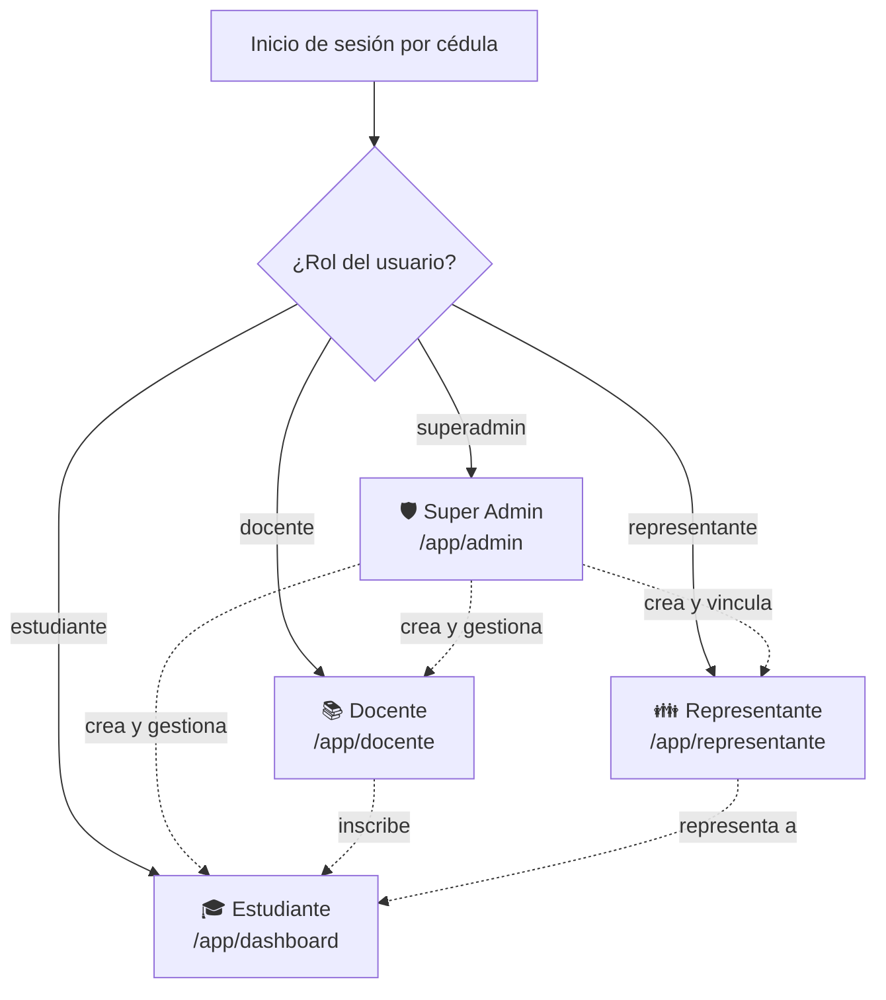

---

## 2. Diagrama de casos de uso (por rol)

### 2.1 🎓 Estudiante

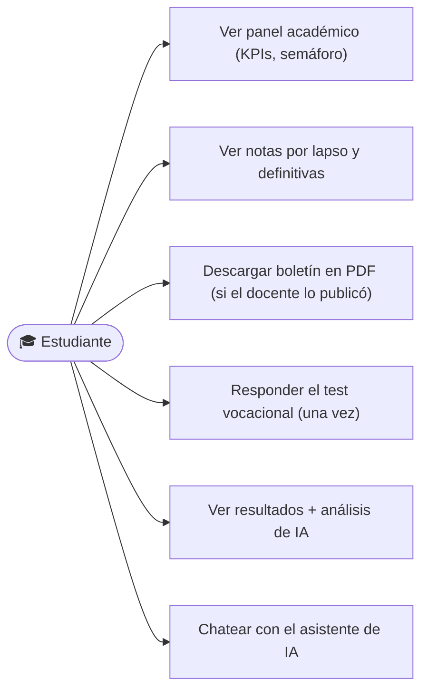

### 2.2 📚 Docente

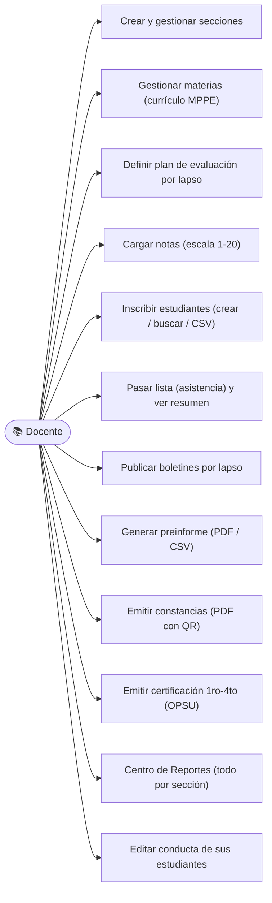

### 2.3 👪 Representante

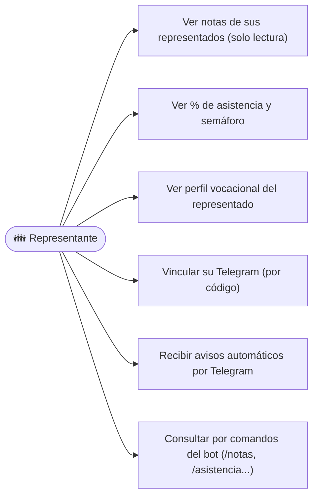

### 2.4 🛡️ Super Admin

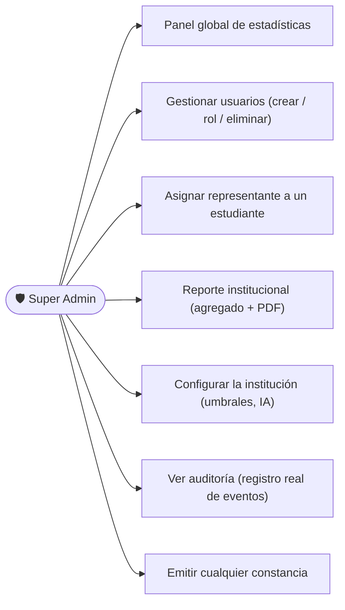

---

## 3. Flujos de procesos principales

### 3.1 Acceso y ruteo por rol

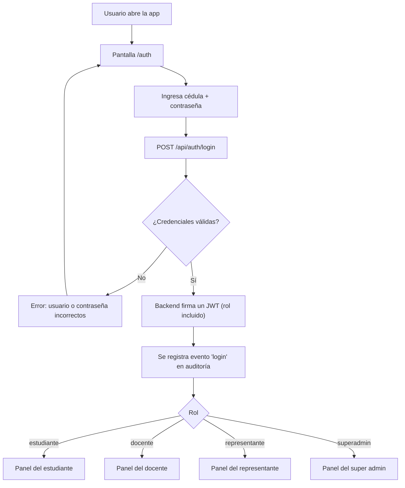

### 3.2 Flujo académico del docente (de la sección a la nota)

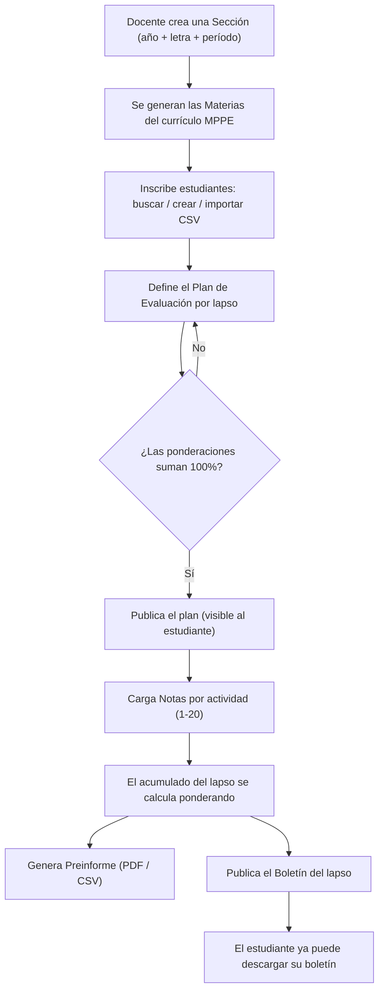

### 3.3 Diagnóstico vocacional con IA

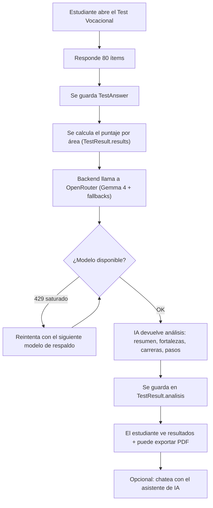

### 3.4 Asistencia + notificación automática por Telegram

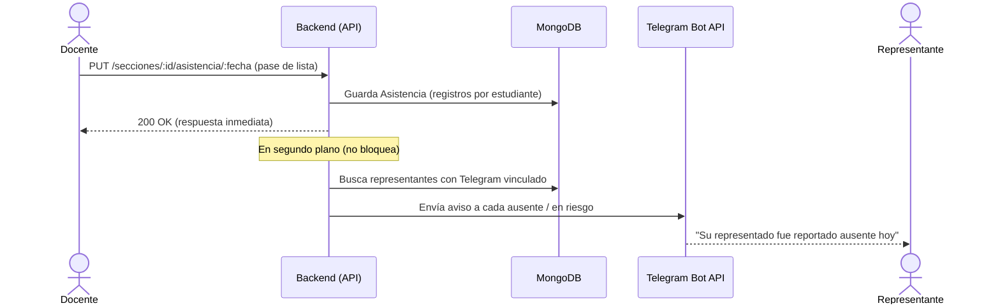

### 3.5 Vinculación del representante con el bot de Telegram

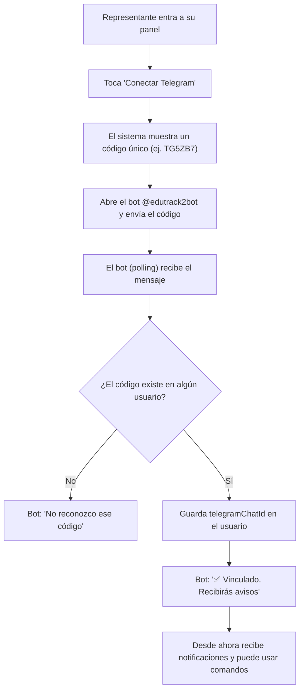

### 3.6 Constancia oficial + verificación pública

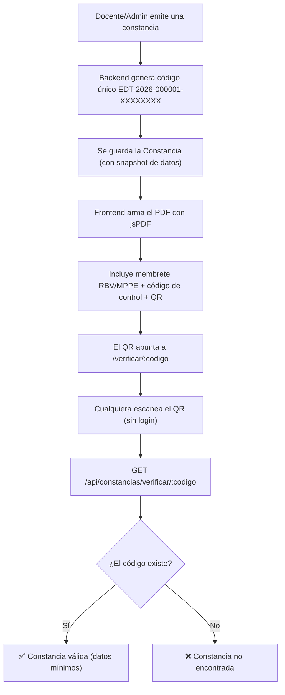

### 3.7 Consulta del representante (solo lectura)

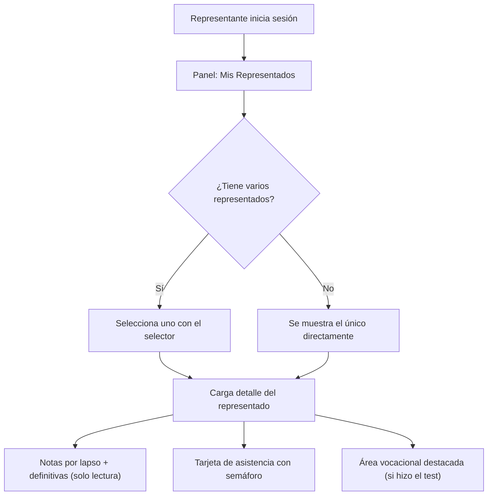

### 3.8 Reporte institucional (Super Admin)

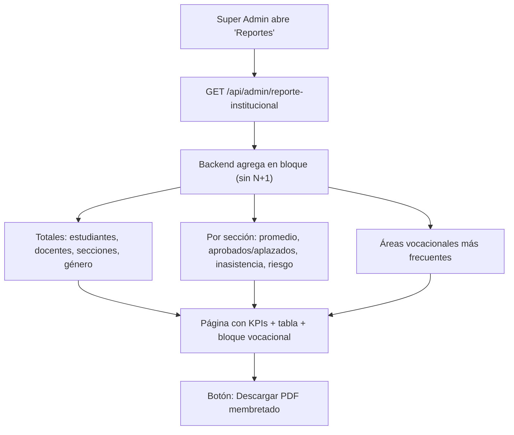

---

## 4. Mapa de módulos por rol (resumen)

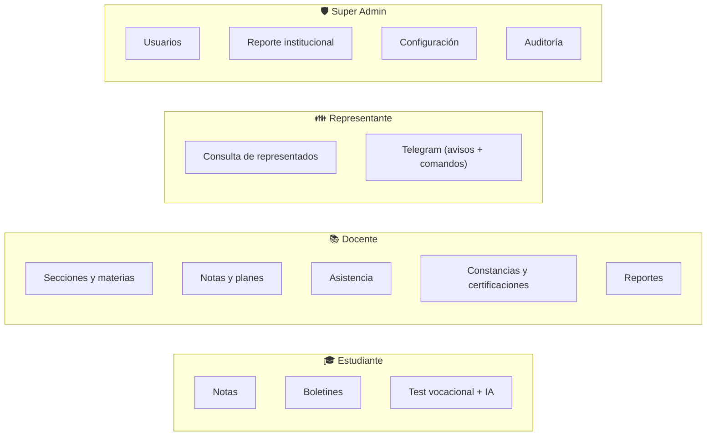

---

*Fuentes: `FLUJOS.md`, `ARQUITECTURA-Y-MODELO-DATOS.md` y el código de
`Backend-Diagnostico-vocacional/src/` y `Frontend-Diagnostico-vocacional/src/`.*
